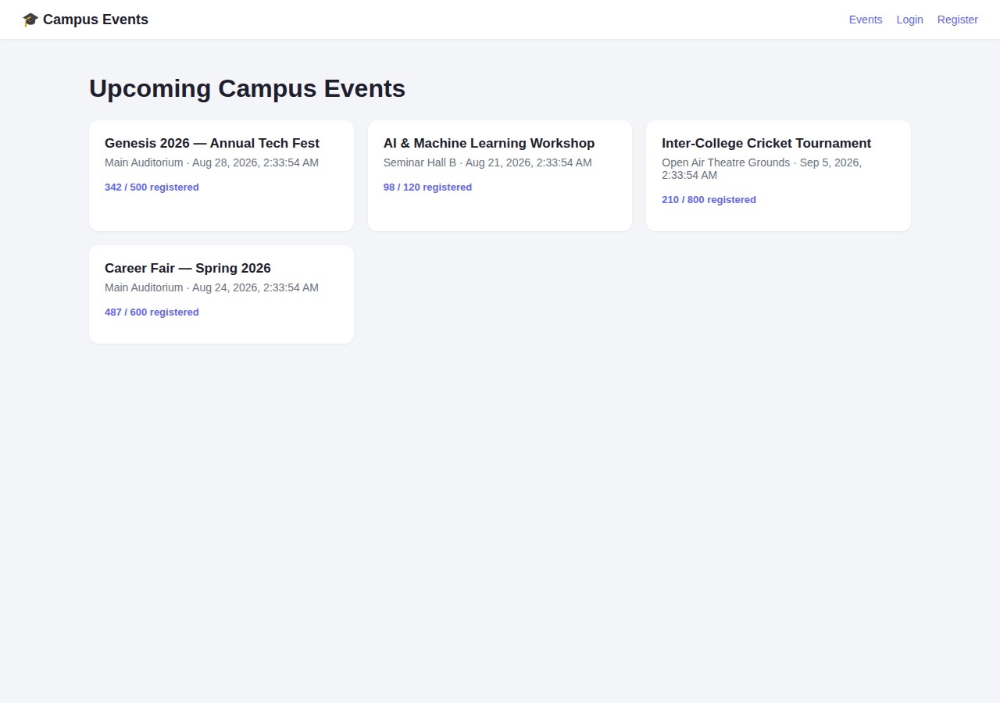
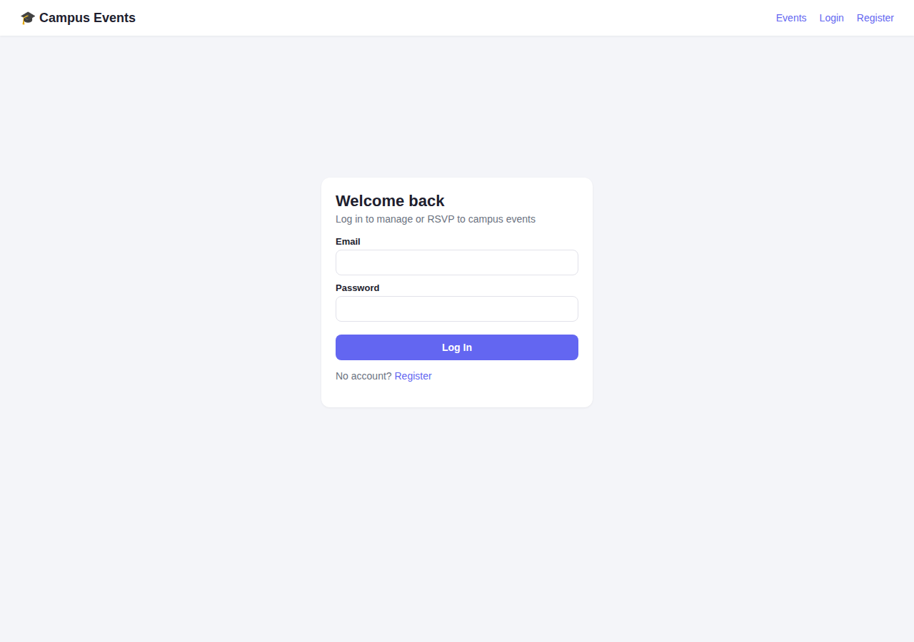
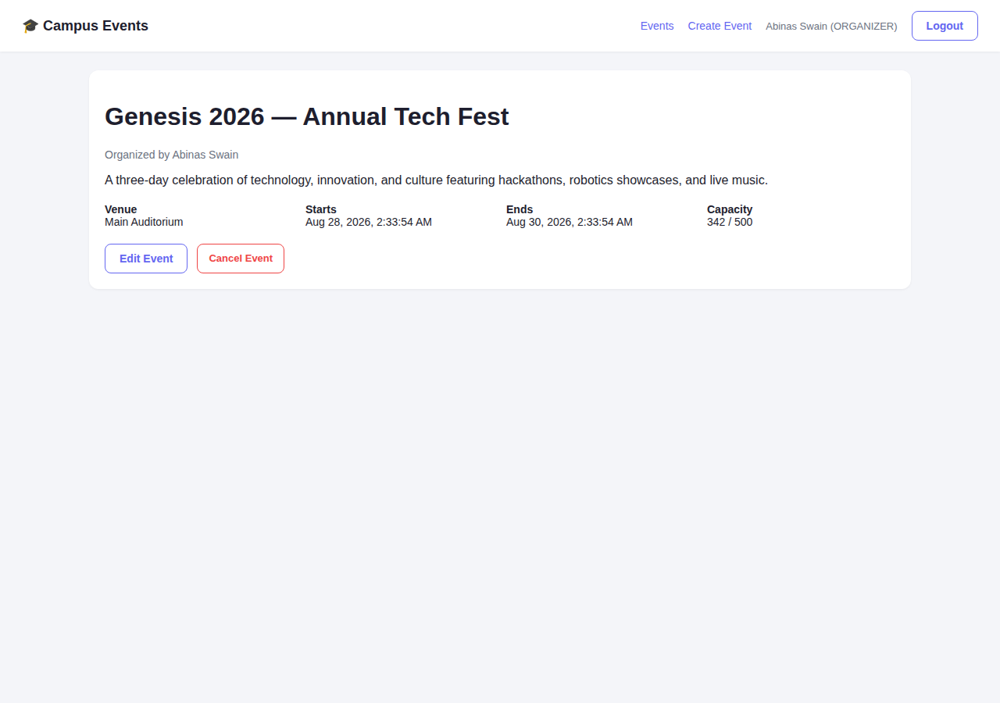
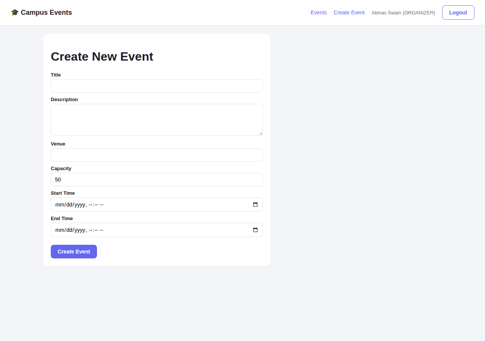

# Campus Event & Resource Management System

A full-stack platform for managing campus events, RSVPs, and shared resource
bookings (venues, equipment) — built with **Angular**, **Spring Boot**, and
**MySQL**.

## Features

-  **JWT authentication** with role-based access control (`ADMIN`, `ORGANIZER`, `ATTENDEE`)
-  **Event management** — create, edit, cancel events (organizers manage their own; admins manage all)
-  **RSVP system** — attendees register for events with automatic capacity enforcement and duplicate-RSVP prevention
-  **Resource booking with conflict detection** — venues/equipment can't be double-booked; overlapping time windows are rejected with a clear error naming the conflicting event
- 🖥 **Responsive Angular dashboard** — standalone components, reactive forms, route guards

## Tech Stack

| Layer     | Technology |
|-----------|------------|
| Frontend  | Angular 18 (standalone components), TypeScript, RxJS |
| Backend   | Java 17, Spring Boot 3.3, Spring Security, Spring Data JPA |
| Database  | MySQL |
| Auth      | JWT (jjwt), BCrypt password hashing |

## Project Structure

```
campus-event-management/
├── backend/                   # Spring Boot REST API
│   ├── pom.xml
│   ├── seed.sql                # optional sample resource data
│   └── src/main/java/com/campus/eventmanagement/
│       ├── entity/              # JPA entities: User, Event, Registration, Resource, ResourceBooking
│       ├── repository/          # Spring Data repositories (incl. overlap-detection query)
│       ├── dto/                 # request/response DTOs
│       ├── service/              # business logic (auth, events, RSVPs, bookings)
│       ├── controller/           # REST endpoints
│       ├── security/             # JWT filter, util, UserDetailsService
│       ├── config/                # SecurityConfig (CORS, route rules)
│       └── exception/             # centralized error handling
│
└── frontend/                  # Angular SPA
    └── src/app/
        ├── core/                 # AuthService, EventService, guards, interceptor
        ├── models/                # TypeScript interfaces
        └── pages/                 # login, register, event list/detail/form
```

## Screenshots

*Captured from the actual running Angular frontend (verified with zero console errors).*

**Event List** — public view, RSVP counts visible to everyone


**Login**


**Event Detail** — Edit/Cancel buttons shown only to the event's organizer or an admin


**Create Event** — reactive form, visible only to ORGANIZER/ADMIN roles


## Getting Started

### Prerequisites
- Java 17+
- Maven 3.8+
- Node.js 18+ and npm
- MySQL 8+ running locally

### 1. Database

```sql
CREATE DATABASE campus_events;
```

Update `backend/src/main/resources/application.properties` with your MySQL
username/password (defaults to `root` / `your_mysql_password` — change this).

### 2. Backend

```bash
cd backend
mvn spring-boot:run
```

The API starts on `http://localhost:8080`. Hibernate auto-creates tables on
first run (`ddl-auto=update`). Optionally load `seed.sql` afterward for sample
venues/equipment.

### 3. Frontend

```bash
cd frontend
npm install
npm start
```

The app opens on `http://localhost:4200` and talks to the API at
`http://localhost:8080/api` (configured in `src/environments/environment.ts`).

### 4. Try it out

1. Register an account (starts as `ATTENDEE`).
2. To test organizer features, promote yourself in MySQL:
   ```sql
   UPDATE users SET role = 'ORGANIZER' WHERE email = 'you@example.com';
   ```
   Then log out and log back in so the new role is reflected in your JWT.
3. Create an event, then RSVP to it from another account.
4. Try booking the same resource for two overlapping time windows via
   `POST /api/bookings` — the second request will fail with a 409 Conflict
   naming the clashing event.

## Key API Endpoints

| Method | Endpoint                          | Access             | Description |
|--------|-------------------------------------|---------------------|--------------|
| POST   | `/api/auth/register`                | Public              | Create account (always `ATTENDEE`) |
| POST   | `/api/auth/login`                   | Public              | Get JWT token |
| GET    | `/api/events`                       | Public              | List published events |
| POST   | `/api/events`                       | ORGANIZER/ADMIN     | Create event |
| PUT    | `/api/events/{id}`                  | Owner/ADMIN         | Update event |
| DELETE | `/api/events/{id}`                  | Owner/ADMIN         | Cancel event |
| POST   | `/api/events/{id}/rsvp`             | Authenticated       | RSVP to event |
| DELETE | `/api/events/{id}/rsvp`             | Authenticated       | Cancel RSVP |
| POST   | `/api/bookings`                     | ORGANIZER/ADMIN     | Book a resource (conflict-checked) |
| GET    | `/api/bookings/event/{eventId}`     | ORGANIZER/ADMIN     | List bookings for an event |

## How Conflict Detection Works

Two time intervals `[s1, e1)` and `[s2, e2)` overlap if and only if
`s1 < e2 AND s2 < e1`. `ResourceBookingRepository.findOverlapping()` runs this
as a single JPQL query against all existing bookings for the requested
resource; if any row comes back, the booking is rejected with a 409 and a
message naming the conflicting event and time window.

## Verified

-  Angular frontend: `ng build` completes with no errors; all 6 pages (event list,
  login, register, event detail, create/edit form, logged-in nav state) rendered
  and screenshotted live with **zero JavaScript console errors** — see Screenshots
  above.
-  Backend: all 34 Java source files pass structural syntax validation.
-  Backend compile/run requires Maven Central access + a live MySQL instance,
  neither of which are reachable from the sandbox this was built in — run
  `mvn spring-boot:run` locally to fully verify. If you hit an error there,
  it's the one part of this project not yet execution-tested end-to-end.

## Possible Extensions

- Email notifications on RSVP/cancellation
- Waitlist when an event hits capacity
- Admin dashboard for promoting users to ORGANIZER
- Calendar (iCal) export for registered events
- Dockerize backend + MySQL for one-command startup

## License

MIT
